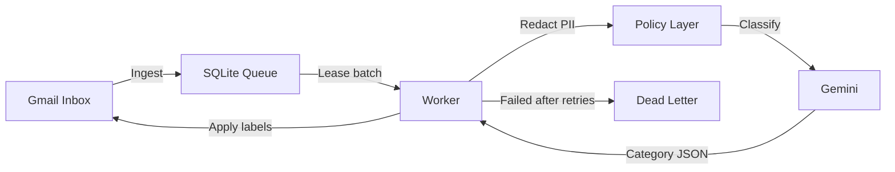

# Gmail Triage Agent

An AI-powered Gmail assistant that automatically reads, classifies, and labels your incoming emails. Built for students and professionals who don't want to miss placement, internship, interview, or deadline updates buried in a noisy inbox.

## What does it do?

Every hour, this bot:
1. **Reads** your new Gmail messages
2. **Classifies** each one using Google's Gemini AI (or keyword-based fallback rules)
3. **Labels** them in your Gmail (e.g., `Placement`, `Academic`, `Finance`, `Spam`)
4. **Logs** everything to a local database so nothing is ever lost

You can run it **locally on your Windows PC** or deploy it to the **cloud on an Azure VM** for 24/7 hands-free operation. Both paths are fully documented below.

## Key features

- Queue-based pipeline using SQLite — if power goes out, it picks up where it left off
- AI classification with confidence scoring (powered by Google Gemini)
- Automatic fallback to keyword rules when the AI quota runs out
- Cost guardrails (`daily_call_cap`) to prevent burning through API credits
- Dead-letter recovery — emails that fail processing can be replayed
- Weekly digest reports from your processed email history
- Scheduled backups with automatic cleanup of old files
- PII redaction — sensitive info (phone numbers, IDs) is stripped before reaching the AI

## Architecture



## Repository layout

```text
config/                Runtime config and category policy
docs/                  Guides and operational notes
  ├── VPS_DEPLOYMENT.md    Full Azure cloud setup guide
  ├── cloud_secrets_workflow.md  How secrets are managed in Docker
  ├── market_comparison.md       Why we built this vs. using n8n/Zapier
  └── production_notes/          Real bugs we hit and how we fixed them
scripts/               Automation scripts for both platforms
  ├── windows_setup.ps1    Windows Task Scheduler installer
  ├── manage_agent.bat     Quick start/stop control panel (Windows)
  ├── backup.ps1           Database backup (Windows)
  ├── backup.sh            Database backup (Linux/Cloud)
  └── daemon.py            Background polling loop (Docker/Cloud)
src/                   Core application logic
tests/                 Test suite
main.py                CLI entry point
schema.sql             Database schema
Dockerfile             Container image definition
docker-compose.yml     Container orchestration
```

---

## 🚀 Choose Your Deployment Path

This project supports two ways to run. Pick the one that fits your situation:

| | **Option A: Local (Windows)** | **Option B: Cloud (Docker + Azure)** |
| :--- | :--- | :--- |
| **Best for** | Trying it out, running on your own PC | Always-on, 24/7 autonomous operation |
| **Requires** | Windows 10/11, Python 3.12 | Azure account (free tier works) |
| **Runs when** | Your PC is on and awake | Always — even when your PC is off |
| **Cost** | Free (just Gemini API) | Free for 12 months on Azure free tier |

---

## Option A: Run Locally on Windows

### 1. Prerequisites

- Windows 10 or 11
- Python 3.12 installed
- A Google Cloud project with Gmail API enabled
- `credentials.json` (OAuth client credentials from Google Cloud Console)
- A Gemini API key (free tier available at [ai.google.dev](https://ai.google.dev))

### 2. Install dependencies

```powershell
py -3.12 -m pip install -r requirements.txt
```

### 3. Configure

```powershell
Copy-Item .env.example .env
```

Open `.env` in any text editor and fill in your values:
- `GEMINI_API_KEY` — your Gemini API key
- `LOG_LEVEL` — (optional) set to DEBUG for verbose logs, or INFO for standard

Place your `credentials.json` in the project root folder.

### 4. First run (generates your Gmail token)

```powershell
py -3.12 main.py run
```

A browser window will open asking you to sign in to Google and grant access. After you approve, a `token.json` file is created automatically. This only happens once.

### 5. Set up automatic scheduling

To make the bot run every hour in the background (even when you're not looking):

```powershell
powershell -ExecutionPolicy Bypass -File .\scripts\windows_setup.ps1
```

This registers two Windows Scheduled Tasks:
- **GmailTriageAgent** — runs `main.py run` every hour
- **GmailTriageBackup** — backs up your database weekly

### 6. Control panel

Double-click `scripts\manage_agent.bat` to get a simple menu:
- Start/Stop the agent
- Run manually
- Check status

### 7. Stop or remove the scheduler

If you ever want to stop the bot or switch to cloud mode:

```powershell
Unregister-ScheduledTask -TaskName 'GmailTriageAgent' -Confirm:$false
Unregister-ScheduledTask -TaskName 'GmailTriageBackup' -Confirm:$false
```

---

## Option B: Deploy to the Cloud (Docker + Azure)

This runs the bot 24/7 on a cloud server so your PC can be completely off.

### 1. Prerequisites

- Everything from Option A's first run (you need a valid `token.json`)
- An Azure account ([free tier](https://azure.microsoft.com/en-us/free/) gives you 12 months of a small VM)
- Docker knowledge is **not** required — all commands are copy-paste

### 2. Quick Docker test (optional, on your own PC)

If you have Docker Desktop installed, you can test the container locally first:

```powershell
docker-compose up --build
```

### 3. Set up your Azure VM

Follow the complete step-by-step guide: **[`docs/VPS_DEPLOYMENT.md`](docs/VPS_DEPLOYMENT.md)**

It walks you through:
- Creating a free-tier Azure VM (Ubuntu + Docker)
- Transferring your code and secrets securely
- Starting the bot as a background service
- Monitoring logs remotely

### 4. Verify it's running

From your Windows terminal:

```powershell
ssh -i "<your-key.pem>" azureuser@<your-vm-ip>
cd ~/gmail-triage
docker compose logs --tail=20
```

You should see lines like:
```
gmail-triage-agent | Gmail Triage Agent — Starting Run
gmail-triage-agent | Sleeping for 60 minutes until next run...
```

---

## CLI commands

These work in both local and cloud environments:

```
main.py run      # Ingest + process one cycle
main.py status   # Queue health summary
main.py digest   # Weekly report from your processed emails
main.py replay   # Requeue emails that failed processing
main.py backup   # Run a database backup
```

**Local usage**: `py -3.12 main.py <command>`
**Cloud usage**: `docker exec gmail-triage-agent python main.py <command>`

## Configuration

All settings live in `config/agent_config.yaml`:

| Setting | What it controls |
| :--- | :--- |
| `categories` | The labels the AI can assign to emails |
| `privacy_rules.exclude_sender_domains` | Domains to skip (e.g., your bank) |
| `model_settings.daily_call_cap` | Max AI calls per day to control costs |
| `scheduler.poll_interval_minutes` | (Local Setup Only) How often the local Windows Task Scheduler runs the check |
| `queue_management.max_retries` | How many times to retry a failed email |

## Operations & Maintenance

### Backups
- **Windows**: `scripts/backup.ps1` creates compressed copies of your database
- **Linux/Cloud**: `scripts/backup.sh` does the same thing on the server
- Both keep the last 7 backups and automatically delete older ones

### Database
- All email records are stored in `app_data.db` (SQLite)
- Before any major upgrade, make a backup: `py -3.12 main.py backup`

### Logs
- Stored in the `logs/` directory
- On Docker/Cloud, use `docker compose logs -f --tail=20` to watch live

## Security and privacy

- **Never commit** `.env`, `token.json`, or `credentials.json` to Git
- The `.gitignore` is already configured to block these files
- All sensitive data (phone numbers, IDs) is **redacted** before being sent to the AI
- You can exclude specific sender domains (like your bank) from processing entirely

## Troubleshooting

### "Invalid Gemini key" error
Update your `.env` file with a valid key and rerun the agent.

### "OAuth token expired" or login issues
Delete `token.json` and run `py -3.12 main.py run` again. A browser window will open to re-authorize.

### Emails stuck in "dead letter" queue
Check the logs for the root cause, fix it, then replay:
```
py -3.12 main.py replay
```

## Further reading

- [Azure Cloud Deployment Guide](docs/VPS_DEPLOYMENT.md) — Full VM setup walkthrough
- [Secrets & Security Workflow](docs/cloud_secrets_workflow.md) — How credentials are handled in Docker
- [Architecture Comparison](docs/market_comparison.md) — Why we built this instead of using n8n or Zapier
- [Production Notes](docs/production_notes/) — Real bugs we encountered and how we solved them

## Contributing

Contributions are welcome. Please review:
- `CONTRIBUTING.md`
- `CODE_OF_CONDUCT.md`

## License

This project is licensed under the terms in `LICENSE`.
