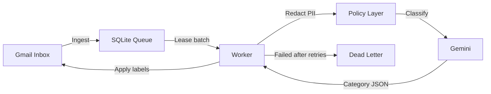

# Gmail Triage Agent

Reliable, local-first Gmail automation that classifies incoming emails, applies labels, and helps you avoid missing placement, internship, interview, and deadline updates.

## Why this project

Most inbox tools fail when APIs timeout, models return odd output, or processes crash mid-run. This project uses queue-first processing, retries, and replay tooling so the workflow remains operational under real-world conditions.

## Key features

- Queue-based pipeline using SQLite for durable processing state
- Structured classification workflow with confidence-aware labeling
- Cost guardrails for model usage (`daily_call_cap`)
- Dead-letter recovery with replay command
- Weekly digest reporting from processed history
- Scheduled backups with retention cleanup (Windows & Linux)
- Windows Task Scheduler integration for local operation
- **Docker support** for cloud deployment (Azure, GCP, etc.)

## Architecture



## Repository layout

```text
config/      Runtime config and category policy
docs/        Architecture notes and operations docs
scripts/     Scheduler setup, backups, and local control scripts
src/         Core ingest, classify, queue, and policy logic
tests/       Test suite
main.py      CLI entry point
schema.sql   Database schema
Dockerfile   Container build definition
docker-compose.yml  Local/cloud container orchestration
```

## Quick start

### 1) Requirements

- Windows 10/11 (recommended for scheduler scripts)
- Python 3.12
- Gmail API OAuth credentials (`credentials.json`)
- Gemini API key

### 2) Setup

```powershell
py -3.12 -m pip install -r requirements.txt
Copy-Item .env.example .env
```

Then update `.env` with your values and place `credentials.json` in the project root.

### 3) Validate install

```powershell
py -3.12 main.py status
```

### 4) Run once manually

```powershell
py -3.12 main.py run
```

## CLI commands

```powershell
py -3.12 main.py run      # Ingest + process one cycle
py -3.12 main.py status   # Queue health summary
py -3.12 main.py digest   # Weekly report from DB
py -3.12 main.py replay   # Requeue dead-letter emails
py -3.12 main.py backup   # Run backup script
```

## Scheduler setup

Register background tasks:

```powershell
powershell -ExecutionPolicy Bypass -File .\scripts\windows_setup.ps1
```

This creates:

- `GmailTriageAgent` (default hourly run)
- `GmailTriageBackup` (weekly DB backup)

Quick control panel:

```powershell
.\scripts\manage_agent.bat
```

## Configuration

Main configuration file: `config/agent_config.yaml`

Important settings:

- `categories`
- `privacy_rules.exclude_sender_domains`
- `model_settings.daily_call_cap`
- `scheduler.poll_interval_minutes`
- `queue_management.max_retries`

## Docker & Cloud Deployment (Azure)

The agent is fully containerized and designed for 24/7 cloud operation on Azure.

### Build and run locally with Docker

```powershell
docker-compose up --build
```

This mounts your local `app_data.db`, `token.json`, `.env`, and `credentials.json` into the container.

### Deploy to Azure VM

See [`docs/VPS_DEPLOYMENT.md`](docs/VPS_DEPLOYMENT.md) for the full step-by-step guide covering:
- VM provisioning (Standard B2ats v2, Ubuntu 24.04 LTS)
- Docker installation on the VM
- Secure secret transfer via `scp`
- Starting the agent with `docker compose up -d --build`

The agent runs as a background daemon and polls Gmail every hour via `scripts/daemon.py`.

## Operations

- Logs: `logs/`
- Backups:
  - **Windows**: `scripts/backup.ps1` writes to `backups/`
  - **Linux/Cloud**: `scripts/backup.sh` writes to `backups/`
- Database: `app_data.db`
- Restore path: keep latest known-good backup before upgrades

### Live cloud monitoring

```bash
ssh -i <key.pem> azureuser@<ip>  # Log into Azure VM
cd ~/gmail-triage
docker compose logs -f --tail=20  # Watch live logs
```

## Security and privacy

- Never commit `.env`, `token.json`, or `credentials.json`
- Keep API keys and OAuth tokens local/private
- Sensitive data is redacted before model calls
- Use sender-domain exclusions for personal/banking mail

## Troubleshooting

### Invalid Gemini key

Update `.env` with a valid key and rerun:

```powershell
py -3.12 main.py run
```

### OAuth token issues

Delete `token.json`, then rerun `py -3.12 main.py run` to re-authorize.

### Growing dead-letter queue

Inspect logs, fix root cause, then replay:

```powershell
py -3.12 main.py replay
```

## Contributing

Contributions are welcome. Please review:

- `CONTRIBUTING.md`
- `CODE_OF_CONDUCT.md`

## License

This project is licensed under the terms in `LICENSE`.
