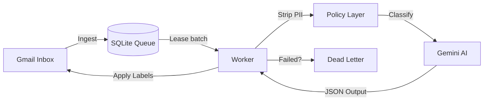

# 📬 Gmail Triage Agent

An AI-powered Gmail assistant that protects your focus by automatically reading, classifying, and labeling your incoming emails. 

Built for students and professionals who are tired of missing placement letters, internship interviews, or critical deadlines buried under a mountain of newsletters and spam. You write the rules, your private AI organizes the inbox.

## ✨ What does it actually do?

Every hour, this bot wakes up and:
1. **Reads** your new, unread Gmail messages.
2. **Redacts** sensitive PII (like phone numbers) so they never leave your machine.
3. **Classifies** each email using Google's Gemini AI (or local keyword fallback rules).
4. **Labels** them directly in your Gmail (e.g., `Exams`, `NPTEL`, `Placement`).
5. **Logs** everything to a local SQLite database so absolutely nothing is ever lost.

You can run it **locally on your Windows PC** while you study, or deploy it to a **free cloud VM** for 24/7 hands-free magic. Both paths are fully documented below.

## 🛠️ Key Features

- **Resilient Queue** 🧱: Powered by SQLite — if the power goes out, it picks up exactly where it left off.
- **AI Classification** 🧠: Highly accurate categorization using Gemini 2.0 Flash.
- **Fallback Safe** 🛟: Automatically switches to local keyword rules if your AI quota runs out.
- **Cost Guardrails** 💸: Strict `daily_call_cap` ensures you never accidentally burn through API credits.
- **Dead-Letter Recovery** ♻️: Emails that fail processing aren't skipped—they are queued to be replayed.
- **Data Sovereignty** 🔒: Phone numbers, student IDs, and SSNs are locally stripped *before* any text goes to the AI.

## 🏗️ Architecture



## 📂 Repository Layout

```text
config/                Runtime config and category policy
docs/                  Guides and operational notes
  ├── vps_deployment.md    Full Azure cloud setup guide
  ├── cloud_secrets_workflow.md  How secrets are managed in Docker
  ├── market_comparison.md       Why we built this vs. using n8n/Zapier
  └── production_notes/          Real bugs we hit and how we fixed them
scripts/               Automation scripts for both platforms
  ├── windows_setup.ps1    Windows Task Scheduler installer
  ├── manage_agent.bat     Quick start/stop control panel (Windows)
  ├── backup.ps1           Database backup (Windows)
  ├── backup.sh            Database backup (Linux/Cloud)
  └── daemon.py            Background polling loop (Docker/Cloud)
src/                   Core application logic
tests/                 Test suite
main.py                CLI entry point
schema.sql             Database schema
Dockerfile             Container image definition
docker-compose.yml     Container orchestration
```

---

## 🚀 Choose Your Deployment Path

This project supports two ways to run. Pick the one that fits your life:

| | **Option A: Local (Windows)** | **Option B: Cloud (Docker + Azure)** |
| :--- | :--- | :--- |
| **Best for** | Trying it out, running strictly on your own hardware | Always-on, 24/7 autonomous operation |
| **Requires** | Windows 10/11, Python 3.12 | Azure account (free tier works perfect) |
| **Runs when** | Your PC is awake | Always — even when your PC is asleep |
| **Cost** | 100% Free | Free for 12 months on Azure Free Tier |

---

## 💻 Option A: Run Locally on Windows

Perfect if you want everything kept strictly on your own hardware.

### 1. Prerequisites
- Windows 10 or 11 with Python 3.12 installed
- A Google Cloud project with the **Gmail API** enabled
- Your `credentials.json` from the Google Cloud Console
- A Google Gemini API key (Grab a free one at [ai.google.dev](https://ai.google.dev))

### 2. Install Dependencies
```powershell
py -3.12 -m pip install -r requirements.txt
```

### 3. Configure Your Environment
```powershell
Copy-Item .env.example .env
```
Open `.env` in any text editor and drop in your keys:
- `GEMINI_API_KEY` — Your Gemini API key
- `LOG_LEVEL` — (optional) set to `DEBUG` if you like seeing the matrix, `INFO` otherwise.

*Make sure your `credentials.json` is sitting in the same folder!*

### 4. The First Run (Authentication)
```powershell
py -3.12 main.py run
```
A browser window will pop open asking you to grant the bot access to your Gmail. After you approve, a `token.json` file is magically created. You only do this once.

### 5. Set up automatic scheduling

To make the bot run every hour in the background (even when you're not looking):

```powershell
powershell -ExecutionPolicy Bypass -File .\scripts\windows_setup.ps1
```
This sets up two Windows Scheduled Tasks:
- **GmailTriageAgent** — Checks your email every hour
- **GmailTriageBackup** — Backs up your database weekly

### 6. Control Panel
Double-click `scripts\manage_agent.bat` anytime to get a nice graphical menu to Start/Stop the agent or check its health.

### 7. Stop or Remove the Scheduler
If you ever want to stop the bot or switch to cloud mode:
```powershell
Unregister-ScheduledTask -TaskName 'GmailTriageAgent' -Confirm:$false
Unregister-ScheduledTask -TaskName 'GmailTriageBackup' -Confirm:$false
```

---

## ☁️ Option B: Deploy to the Cloud (Docker)

Want the true "AI Agent" experience where it works for you 24/7 while your laptop is closed? 

### 1. Prerequisites
- Everything from Option A's "First Run" (You **must** have a valid `token.json` generated locally first!)
- An Azure account (or any VPS).
- Docker knowledge is **not** required.

### 2. The Step-by-Step Guide
Because deploying servers can be tricky, we wrote a dedicated, copy-paste guide just for this: 

👉 **[`docs/vps_deployment.md`](docs/vps_deployment.md)** 👈

It walks you through:
- Creating a free-tier Azure VM (Ubuntu + Docker)
- Transferring your code and secrets securely
- Starting the bot as a background service
- Monitoring logs remotely

### 3. Verify It's Alive
From your local terminal, SSH into your server and check the heartbeats:
```bash
ssh -i "<your-key.pem>" azureuser@<your-vm-ip>
cd ~/gmail-triage
docker compose logs -f --tail=20
```

---

## 🎛️ CLI Commands & Operations

Whether you are local or in the cloud, these commands manage your bot:

```bash
python main.py run      # Ingest your inbox and classify a batch of emails
python main.py status   # Check the health of your queue
python main.py digest   # Weekly report from your processed emails
python main.py replay   # Re-queue any emails that got stuck or failed
python main.py backup   # Force a manual database backup
```
*(If on Docker, prepend commands with docker execution: `docker exec gmail-triage-agent python main.py <command>`)*

## ⚙️ Configuration

All the brains of the operation live in **`config/agent_config.yaml`**:

| Setting | What it controls |
| :--- | :--- |
| `categories` | The labels the AI can assign to emails |
| `privacy_rules.exclude_sender_domains` | Domains to skip (e.g., your bank) |
| `model_settings.daily_call_cap` | Max AI calls per day to control costs |
| `scheduler.poll_interval_minutes` | (Local Setup Only) How often the local Windows Task Scheduler runs the check |
| `queue_management.max_retries` | How many times to retry a failed email |

## 🛠️ Operations & Maintenance

### Backups
- **Windows**: `scripts/backup.ps1` creates compressed copies of your database
- **Linux/Cloud**: `scripts/backup.sh` does the same thing on the server
- Both keep the last 7 backups and automatically delete older ones

### Database
- All email records are stored in `app_data.db` (SQLite)
- Before any major upgrade, make a priority backup: `py -3.12 main.py backup`

### Logs
- Stored locally in the `logs/` directory
- On Docker/Cloud, use `docker compose logs -f --tail=20` to watch live

## 🛡️ Security & Privacy Note

- **Never commit** `.env`, `token.json`, or `credentials.json` to Git. (The `.gitignore` has your back, but be careful).
- Remember: Your unredacted emails *never* leave your environment. Read our [market comparison](docs/market_comparison.md) for a deep dive into why this is safer than using Zapier or n8n.

## 🚑 Troubleshooting

### "Invalid Gemini key" error
Update your `.env` file with a valid key and rerun the agent.

### "OAuth token expired" or login issues
Delete `token.json` and run `py -3.12 main.py run` again. A browser window will open to re-authorize.

### Emails stuck in "dead letter" queue
Check the logs for the root cause, fix it, then replay:
```powershell
py -3.12 main.py replay
```

## 📚 Further Reading

Looking to dive deeper?
- [Azure Cloud Deployment Guide](docs/vps_deployment.md) — Full VM setup walkthrough.
- [Architecture Comparison](docs/market_comparison.md) — Why custom Python beats Low-Code platforms.
- [Secrets Workflow](docs/cloud_secrets_workflow.md) — How we securely manage API keys in Docker.
- [Production Notes](docs/production_notes/) — Short, readable stories about bugs we hit and how we fixed them.

## 🤝 Contributing & License

Contributions are always welcome. Please see `CONTRIBUTING.md` and `CODE_OF_CONDUCT.md`. 
This project is licensed under the MIT License (`LICENSE`).
